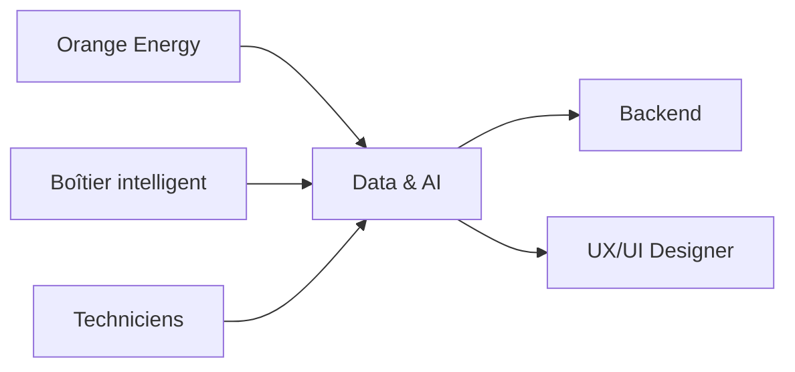
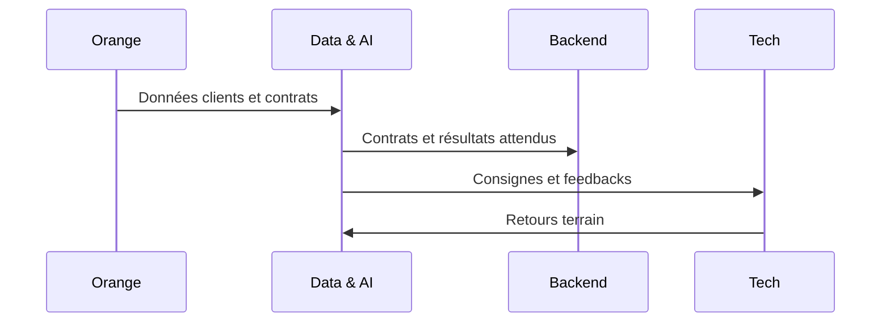
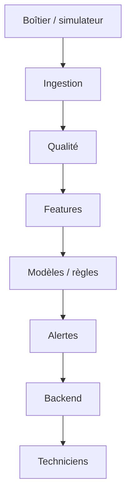
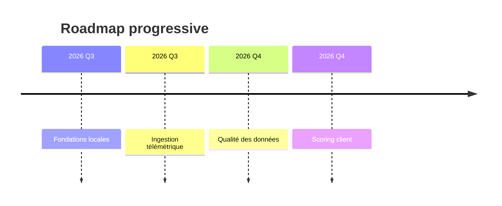

# Djua Energy Data & AI

## Présentation de Djua Energy

Djua Energy est une plateforme de données, d’intelligence artificielle et d’Internet des objets destinée à améliorer la gestion de kits solaires Pay-As-You-Go. Le projet vise à fournir un socle local de collecte, d’observation, de qualité des données et de préparation des cas d’usage futurs.

## Problème métier

Le secteur du Pay-As-You-Go repose sur une forte qualité de service, la stabilité des équipements et la capacité à détecter rapidement les anomalies, les comportements suspects et les risques clients. Les données sont dispersées entre Orange Energy, les boîtiers intelligents, les techniciens et les historiques de paiement.

## Vision de la plateforme

La plateforme future réunira les données clients, les contrats, les paiements, les télémétries, les retours terrain et les résultats d’analyse. Le MVP initial sera local, simple et volontairement modulaire pour rester cloud-ready à terme.

## Statut actuel du dépôt

Le dépôt est actuellement au stade de structuration. Aucune fonctionnalité métier n’a encore été développée. L’objectif de cette première livraison est de poser une architecture de travail claire, cohérente et documentée.

## Structure détaillée du dépôt

Le dépôt est organisé pour permettre un développement local, modulaire et extensible, avec une séparation claire entre l’API, le pipeline de données, la logique métier et la documentation.

```text
djua-energy-data-ai/
├── apps/
│   ├── api/
│   │   └── main.py                 # API FastAPI locale pour la démo IoT
│   ├── simulator/                  # futur simulateur de boîtiers
│   └── worker/                     # futur worker d’ingestion ou de traitement
├── artifacts/                      # modèles entraînés et métadonnées locales
├── config/                         # paramètres et règles de configuration
├── data/
│   ├── generated/                  # données synthétiques générées localement
│   ├── raw/                        # données brutes à venir
│   ├── curated/                    # données nettoyées / prêtes à l’usage
│   ├── features/                   # features extraites
│   └── synthetic/                  # jeux de données synthétiques
├── docs/                           # documentation métier, architecture et roadmap
├── infra/                          # préparation infra locale / cloud-ready
├── notebooks/                      # explorations et prototypes
├── reports/                        # rapports, preuves et résultats
├── schemas/                        # schémas JSON des contrats de données
├── scripts/
│   └── demo_pipeline.py           # démonstration bout-en-bout du pipeline
├── src/
│   └── djua_energy/
│       ├── api/                    # logique API future et services associés
│       ├── common/                 # utilitaires partagés
│       ├── config/                 # lecture de configuration
│       ├── maintenance/            # services métier de maintenance
│       ├── pipeline/               # cœur du premier vertical slice
│       │   ├── contracts.py        # validation des payloads IoT
│       │   ├── features.py         # construction des features
│       │   ├── inference.py        # inférence locale sur les modèles
│       │   ├── synthetic_data.py   # génération de données synthétiques
│       │   └── train.py            # entraînement des modèles locaux
│       ├── scoring/                # futurs moteurs de score client
│       └── ...                     # autres modules métier à venir
├── tests/
│   └── unit/                       # tests de validation et de pipeline
├── pyproject.toml                   # métadonnées du projet et dépendances Python
└── README.md                        # documentation principale du dépôt
```

### Rôle des principaux fichiers et modules

- [README.md](README.md) : document de référence du projet, contexte métier, architecture et statut.
- [pyproject.toml](pyproject.toml) : décrit le package Python et ses dépendances principales.
- [apps/api/main.py](apps/api/main.py) : API locale FastAPI avec des endpoints de santé et de prédiction.
- [src/djua_energy/pipeline/contracts.py](src/djua_energy/pipeline/contracts.py) : valide les payloads IoT avant toute transformation.
- [src/djua_energy/pipeline/synthetic_data.py](src/djua_energy/pipeline/synthetic_data.py) : génère des données de télémétrie synthétiques, localement et de façon reproductible.
- [src/djua_energy/pipeline/features.py](src/djua_energy/pipeline/features.py) : construit les variables utiles pour la maintenance et la sécurité.
- [src/djua_energy/pipeline/train.py](src/djua_energy/pipeline/train.py) : entraîne des modèles de base et sauvegarde les artefacts locaux.
- [src/djua_energy/pipeline/inference.py](src/djua_energy/pipeline/inference.py) : charge les modèles entraînés et produit des prédictions locales.
- [scripts/demo_pipeline.py](scripts/demo_pipeline.py) : exécute une démo complète de génération, entraînement et inférence.
- [tests/unit/test_pipeline.py](tests/unit/test_pipeline.py) : couvre la validation, la génération de données et la construction des features.
- [artifacts](artifacts) : contient les modèles entraînés et métadonnées générés localement.

### Pourquoi ces fichiers existent

- Les fichiers du module pipeline sont au cœur du premier vertical slice : ils montrent comment on passe du signal brut à une prédiction exploitable.
- Le dossier apps contient l’interface d’exposition locale, ce qui permet de tester l’outil sans dépendre d’un cloud.
- Les dossiers docs, schemas et infra préparent la montée en complexité sans casser la structure initiale.
- Les dossiers data et artifacts servent de zone de travail locale pour les données et les résultats produits pendant les expérimentations.

### Dépendances installées et raisons d’être

Le projet utilise aujourd’hui les dépendances suivantes :

- fastapi : pour exposer une API locale légère et testable.
- uvicorn : pour servir l’API FastAPI en local.
- pandas : pour manipuler les données sous forme de DataFrame et construire des features.
- scikit-learn : pour entraîner des modèles de base simples et explicables.
- joblib : pour sérialiser les modèles et les features vers des fichiers locaux.
- pytest : pour automatiser des tests unitaires et valider rapidement les évolutions.

Ces dépendances ont été choisies pour garder le projet local-first, simple à comprendre et facile à déployer sur un poste de développement.

## Objectif de cette première version

Cette première version a pour but de créer une base de travail professionnelle, facilement extensible, avec :

- une arborescence claire ;
- une documentation fonctionnelle et technique ;
- une gouvernance minimale ;
- des contrats de données à définir progressivement ;
- une préparation aux futures étapes d’ingestion et d’IA.

## Ce qui existe actuellement

- une structure de dépôt organisée ;
- une documentation de référence en français ;
- une organisation des dossiers par domaine métier et technique ;
- un plan de développement progressif ;
- des fichiers de configuration et de gouvernance initiaux.

## Ce qui n’existe pas encore

- aucune API FastAPI fonctionnelle ;
- aucun stockage MySQL opérationnel ;
- aucun modèle Machine Learning entraîné ;
- aucun simulateur IoT actif ;
- aucun pipeline de données en production ;
- aucune règle métier opérationnelle.

## Cas d’usage futurs

- UC-01 — Scoring du risque client.
- UC-02 — Actualisation du risque client pendant le contrat.
- UC-03 — Ingestion des données télémétriques IoT.
- UC-04 — Détection d’anomalies de batterie.
- UC-05 — Maintenance prédictive.
- UC-06 — Détection de mouvement suspect, sabotage ou fraude potentielle.
- UC-07 — Priorisation des alertes.
- UC-08 — Enregistrement du retour des techniciens.
- UC-09 — Préparation du réentraînement futur des modèles.

## Membres de l’équipe

- Data & AI Engineer
- Backend Developer
- Embedded Systems Engineer
- UX/UI Designer
- Orange Energy
- Techniciens de terrain

## Responsabilités du pôle Data & IA

Le pôle Data & IA sera responsable de la qualité des données, des contrats de données, des features, de la préparation des cas d’usage, de la gouvernance des modèles et de la documentation d’intégration.

## Données attendues d’Orange Energy

- informations clients ;
- données contractuelles ;
- historiques de paiement ;
- informations de conformité et de segmentation.

## Données attendues du boîtier

- identifiant du dispositif ;
- état de batterie ;
- température ;
- messages de statut ;
- événements de mouvement ou de manipulation.

## Éléments attendus du backend

- routes API propres ;
- intégration des services métier ;
- exposition des résultats de prédiction ou d’alerte ;
- cohérence des contrats de données.

## Éléments attendus des techniciens

- retours terrain structurés ;
- signalement des incidents et interventions ;
- validation humaine des cas complexes.

## Éléments fournis au designer

- parcours utilisateur ;
- schémas d’interface ;
- logique d’alerte et de priorisation ;
- besoins de visualisation.

## Architecture locale cible

Le MVP sera d’abord local. Le futur système pourra ensuite être déployé sur une infrastructure cloud, sans que le dépôt n’introduise aujourd’hui de dépendance à un fournisseur spécifique.

## Principes cloud-ready

- séparation claire des couches ;
- configuration externe ;
- contrats de données explicites ;
- modularité des services ;
- maintien d’un socle local reproductible.

## Technologies prévues

- Python 3.12
- FastAPI
- MySQL 8
- SQLAlchemy 2
- Alembic
- Eclipse Mosquitto
- paho-mqtt
- Pandas ou Polars
- Parquet
- DuckDB
- scikit-learn
- MLflow
- pytest
- Docker et Docker Compose

## Arborescence du dépôt

```text
apps/              # applications futures
config/            # règles et paramètres
data/              # données brutes, curées, features et synthétiques
docs/              # documentation fonctionnelle et technique
infra/             # environnement local et préparation cloud
migrations/        # futures migrations de base de données
notebooks/         # explorations et prototypages
reports/           # rapports et preuves
schemas/           # schémas JSON des contrats
scripts/           # scripts d’outillage et de préparation
src/               # code Python structuré
tests/             # tests à venir
```

## Explication des dossiers principaux

- apps : applications API, worker et simulateur futures.
- config : paramètres indépendants du code métier.
- data : zone d’absorption des données, de leur préparation et de leur archivage.
- docs : référentiel, architecture, gouvernance et roadmap.
- infra : environnement local et plan de migration cloud.
- src : base de code Python du projet.

## Méthode de développement étape par étape

Chaque évolution sera livrée selon un cycle précis :

1. expliquer la fonctionnalité ;
2. justifier son ordre ;
3. identifier les fichiers impactés ;
4. définir les données et dépendances ;
5. proposer un mini-plan ;
6. attendre validation ;
7. implémenter la fonctionnalité validée.

## Première fonctionnalité recommandée

La première fonctionnalité recommandée est :

- initialisation technique locale et définition du contrat de télémétrie v1.

## Roadmap générale

1. Fondations locales et contrats.
2. Ingestion IoT.
3. Qualité des données.
4. Scoring client.
5. Anomalies et maintenance.
6. Feedback terrain.
7. MLOps et observabilité.
8. Intégration globale.

## Règles de contribution

- documenter chaque changement majeur ;
- ne pas introduire de fonctionnalité métier sans validation ;
- conserver la modularité et la traçabilité ;
- éviter les dépendances cloud avant le moment prévu.

## Stratégie Git

Le dépôt sera géré via des branches dédiées, avec des pull requests documentés et une revue minimale avant intégration.

## Règles de validation

Chaque étape sera validée par :

- lecture de la documentation ;
- contrôle de la structure ;
- absence de logique métier non validée ;
- cohérence des fichiers modifiés.

## Definition of Done

Une étape est considérée comme terminée lorsque :

- la fonctionnalité attendue est implémentée ;
- la documentation associée est à jour ;
- les tests pertinents ont été réalisés ;
- les dépendances et responsabilités sont explicites.

## Limitations

Le dépôt n’est pas encore une application fonctionnelle. Les fichiers présents ne doivent pas être utilisés comme preuve d’un modèle déjà entraîné ou d’un système opérationnel.

## Avertissement sur les données synthétiques

Les futures données utilisées pour les premiers prototypages seront d’abord synthétiques, locales et sans finalité de production réelle.

## Licence et gouvernance

Le dépôt est préparé pour une gouvernance simple et professionnelle. La licence et les règles d’engagement seront ajustées selon les besoins de l’équipe.

## Diagrammes

### Contexte général



### Échanges entre équipes



### Futur flux de données



### Progression étape par étape


