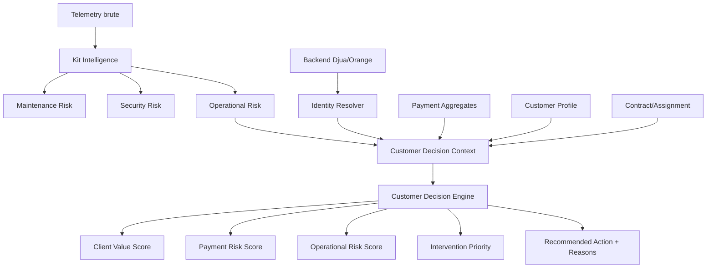

# Customer Scoring Architecture Report

Date: 2026-08-18

## 1. Resume Executif

Le module de scoring client existant etait un bon MVP de risque de paiement, mais il ne couvrait pas encore la vraie decision client Djua Energy. Le systeme devait evoluer d'un score unique de defaut a 90 jours vers un moteur multidimensionnel capable de combiner valeur client, risque de paiement, risque operationnel du kit et priorite d'intervention.

L'architecture retenue conserve l'existant fonctionnel et ajoute une nouvelle couche explicable: `CustomerDecisionEngine`. Ce moteur consomme un snapshot Backend -> IA ou l'identite client-kit est deja resolue par le backend.

## 2. Fonctionnement Avant

Le scoring client avant cette evolution reposait sur:

- `src/djua_energy/features/customer_features.py`: transformation d'un payload externe en features.
- `src/djua_energy/scoring/model.py`: entrainement et inference d'un `RandomForestClassifier`.
- `src/djua_energy/scoring/service.py`: appel API externe via telephone puis scoring.
- `src/djua_energy/scoring/rules.py`: garde-fous metier simples.
- `src/djua_energy/scoring/explainability.py`: explication locale ou OpenAI.
- `artifacts/customer_scoring_model.joblib`: modele ML de defaut client.

La cible ML etait `default_next_90d`. Le score etait donc essentiellement un Payment Risk inverse:

```text
score = 100 - probabilite_de_defaut * 100
```

En parallele, les routes frontend construisaient un profil client de demonstration derive du risque kit, avec `payment_risk` marque `not_available`.

## 3. Problemes Identifies

1. Le client etait trop reduit au risque de paiement.
2. La route `/scoring/customers/{phone}` utilisait le telephone comme cle d'appel.
3. Le profil frontend client etait derive des modeles kit, sans vraie liaison client-kit persistante.
4. Les schemas `payment.v1` et `contract.v1` etaient des placeholders.
5. La qualite de donnees n'etait pas explicite pour le scoring client.
6. Le systeme ne distinguait pas correctement urgence technique et suivi commercial.
7. Les sorties maintenance/securite etaient disponibles mais pas encore composees proprement dans une decision client.

## 4. Gap Analysis

### KEEP

- Modele actuel `customer_scoring_model.joblib` comme baseline Payment Risk.
- `CustomerScoringService.score_payload()` pour compatibilite demo.
- Pipelines maintenance et securite via `LocalInferenceEngine`.
- Contrat telemetrie existant.
- Provenance `model_output`, `model_derived`, `not_available` dans les routes frontend.

### ADAPT

- `CustomerScoringService` expose maintenant aussi `evaluate_customer_context()`.
- Le scoring client devient une composition de dimensions plutot qu'un score unique.
- Les contrats paiement et contrat deviennent exploitables par le backend.

### REFACTOR

- A terme, renommer conceptuellement l'ancien modele en `PaymentRiskModel`.
- Extraire les schemas Pydantic API vers des modules dedies si l'API grossit.
- Faire porter les regles de ponderation par configuration metier.

### REMOVE

- Aucune suppression dans ce MVP.
- Les routes et demos existantes restent compatibles.

### CREATE

- `CustomerDecisionEngine`.
- Contrat `customer_decision_context.v1`.
- Contrat `customer_decision_result.v1`.
- Tests de decision client multidimensionnelle.
- Ce rapport d'architecture.

## 5. Architecture Retenue



Principe cle: l'IA ne devine jamais la relation client-kit. Le backend est proprietaire de l'identite, des contrats, des paiements et de l'affectation active.

## 6. Responsabilites Backend

Le backend doit:

- recevoir la telemetrie brute;
- conserver `event_time` et `received_at`;
- rattacher `device_id -> kit_id -> assignment_id -> contract_id -> client_id`;
- historiser les affectations client-kit avec `valid_from` et `valid_to`;
- enrichir avec contexte: region, saison, periode de journee, meteo;
- agreger les paiements;
- fournir a l'IA un snapshot coherent et date.

Le backend ne doit pas demander a l'IA de faire une jointure par nom, telephone ou similarite textuelle.

## 7. Responsabilites IA

La partie IA doit:

- valider le snapshot recu;
- refuser ou degrader la confiance si l'identite est incomplete;
- produire des scores separes;
- expliquer les raisons;
- retourner la confiance et les warnings;
- garder la compatibilite avec les modeles maintenance/securite et payment risk existants.

## 8. Contrat Backend -> IA

Endpoint ajoute:

```http
POST /v1/customer/evaluate
```

Schema:

```text
schemas/customer_decision_context.v1.schema.json
```

Exemple minimal:

```json
{
  "schema_version": "1.0",
  "request_id": "req-123",
  "as_of": "2026-08-18T14:30:00+02:00",
  "identity": {
    "client_id": "client-923",
    "kit_id": "kit-034",
    "device_id": "device-001",
    "installation_id": "installation-674",
    "contract_id": "contract-884",
    "assignment_id": "assignment-889"
  },
  "telemetry": {
    "event_time": "2026-08-18T14:29:45+02:00",
    "battery_temperature_c": 48.2,
    "state_of_charge_pct": 32,
    "state_of_health_pct": 78,
    "connection_status": "connected"
  },
  "payment": {
    "late_payments_last_6_months": 2,
    "average_days_late": 5.2,
    "outstanding_balance": 0,
    "last_payment_status": "paid"
  },
  "customer": {
    "tenure_months": 18,
    "active_contracts": 1,
    "customer_segment": "residential"
  },
  "contract": {
    "periodic_amount_usd": 20,
    "status": "active"
  },
  "kit_intelligence": {
    "maintenance_risk": 0.84,
    "security_risk": 0.12,
    "battery_health": "degraded",
    "critical_anomaly": true
  },
  "data_quality": {
    "identity_resolved": true,
    "telemetry_age_seconds": 15,
    "missing_features": []
  }
}
```

## 9. Sortie IA

Schema:

```text
schemas/customer_decision_result.v1.schema.json
```

Exemple:

```json
{
  "schema_version": "customer-decision-result.v1",
  "identity_status": "resolved",
  "scores": {
    "client_value": 70,
    "payment_risk": 24,
    "operational_risk": 90,
    "intervention_priority": 83
  },
  "decision": {
    "priority": "high",
    "recommended_action": "urgent_technical_intervention",
    "human_review_required": true
  },
  "reasons": [
    "operational_risk_critical",
    "battery_temperature_high",
    "state_of_health_degraded"
  ],
  "confidence": 0.9
}
```

## 10. Scores Disponibles

### Client Value Score

Estime l'importance du client a partir de l'anciennete, du nombre de contrats, du segment et de la valeur contractuelle.

### Payment Risk Score

Mesure le risque de paiement avec retards, paiements manques, echecs, solde restant, recence et statut du dernier paiement.

### Operational Risk Score

Compose les sorties maintenance/securite et certains signaux directs du kit. Le moteur privilegie `kit_intelligence` lorsque les modeles techniques ont deja produit leurs indicateurs.

### Intervention Priority

Determine l'ordre d'action. La priorite technique depend surtout du risque operationnel et de la valeur client. Le risque paiement eleve avec kit sain produit plutot un suivi commercial.

## 11. Gestion Des Erreurs Et Data Quality

Le moteur retourne:

- `identity_status`: `resolved`, `partial`, `unresolved`, `kit_without_customer`, `invalid`;
- `data_quality.status`: `complete`, `partial`, `blocked`;
- `missing_features`;
- `warnings`;
- `confidence`.

Cas importants:

- kit sans client: `resolve_identity`, confiance `0`;
- schema incorrect: `fix_payload`;
- paiement absent: score paiement neutre `50`, mais qualite `partial`;
- telemetrie obsolete: qualite `partial`;
- identite partielle: decision possible mais confiance reduite.

## 12. Flux De Temps

Le contrat conserve la distinction:

```text
event_time = moment de mesure terrain
received_at = moment de reception plateforme
as_of = instant du snapshot de decision
```

Si `telemetry_age_seconds` n'est pas fourni, le moteur tente de le calculer depuis `event_time` et `as_of`.

## 13. Fichiers Modifies Ou Crees

Crees:

- `src/djua_energy/scoring/decision_engine.py`
- `schemas/customer_decision_context.v1.schema.json`
- `schemas/customer_decision_result.v1.schema.json`
- `tests/unit/test_customer_decision_engine.py`
- `docs/customer_scoring_architecture_report.md`

Modifies:

- `src/djua_energy/scoring/service.py`
- `apps/api/main.py`
- `schemas/payment.v1.schema.json`
- `schemas/contract.v1.schema.json`

## 14. Tests Effectues

Commande:

```powershell
.\.venv\Scripts\python.exe -m pytest tests\unit\test_customer_decision_engine.py tests\unit\test_customer_scoring.py -q
```

Resultat:

```text
17 passed
```

Cas couverts:

1. client valide + kit valide;
2. client avec plusieurs kits;
3. kit sans client;
4. donnees paiement absentes;
5. telemetrie obsolete;
6. anomalie technique critique;
7. excellent client + kit critique;
8. mauvais payeur + kit sain;
9. client important + risque operationnel eleve;
10. donnees manquantes;
11. endpoint API;
12. version de schema incorrecte.

## 15. Limites Restantes

- Les ponderations sont encore codees dans un moteur rule-based MVP.
- Les donnees paiement reelles Orange ne sont pas encore connectees.
- La table d'affectation client-kit n'existe pas encore dans la persistance locale.
- L'ancien modele ML reste centre sur le defaut paiement a 90 jours.
- Les sorties maintenance/securite restent issues de donnees synthetiques.
- Il faudra ajouter un stockage des decisions client pour audit longitudinal.

## 16. Prochaines Connexions Backend

Le backend Orange/Djua devra fournir:

- historique d'affectation `kit_id -> customer_id`;
- contrats actifs et suspendus;
- agregats paiement par fenetre;
- statut de compte client;
- timestamp `received_at`;
- indicateurs de qualite et champs manquants;
- sorties recentes maintenance/securite par kit.

La frontiere est maintenant claire: le backend construit la verite metier, l'IA construit la decision.
